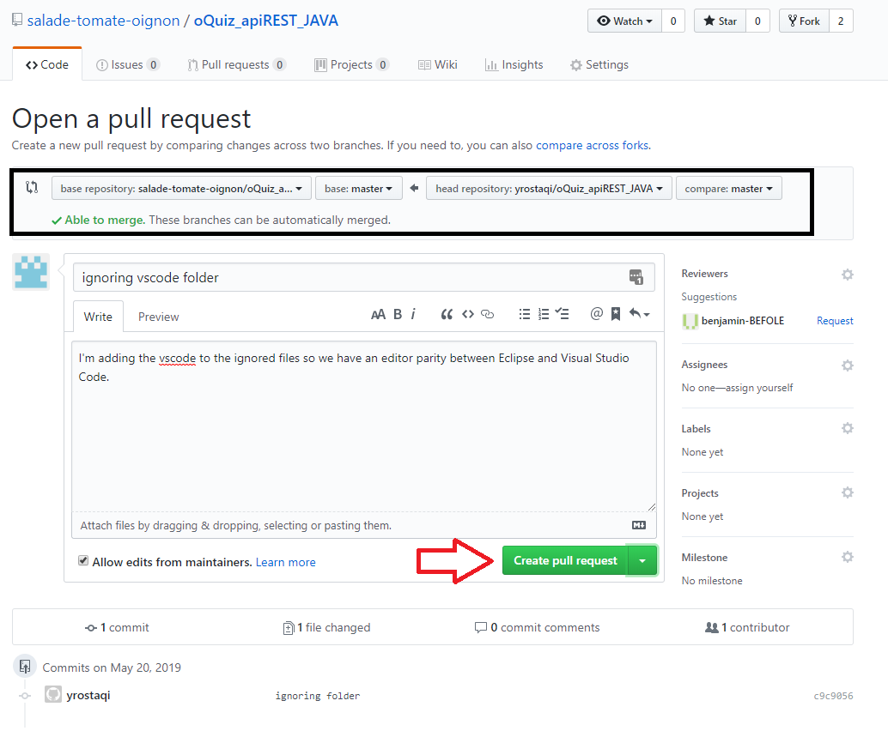

# Tutoriel de mise en place et d'utilisation du git de groupe

* [Git config](#git-config)
* [Mise en place](#mise-en-place)
* [Utilisation](#utilisation)

## Git config

Tout d'abord, pensez à dire à votre git qui vous êtes pour qu'il arrête de vous harceler à chaque commit (facultatif)
```
git config --global user.name "Prénom Nom"
git config --global user.email "[votre mail github]"
```

## Mise en place

### Fork

Afin d'éviter un maximum les conflits gits, nous allons utiliser des Forks, il s'agit simplement d'une copie personnelle du git de l'organisation.
L'exemple présenté est réalisé sur le git *oQuiz_apiREST_JAVA* avec mon compte (Yossef Rostaqi).


* Tout d'abord, placez vous dans le git que vous souhaitez forker (ici le oQuiz_apiREST_JAVA du groupe) et cliquez sur le bouton *Fork*:


* Il vous sera ensuite demandé à quel endroit Forker ce git, choissisez votre nom :


* Et voilà, vous disposez désormais de votre propre version du projet !


### Clone

Vous pouvez ensuite cloner VOTRE version du projet de manière tout à fait classique :
```
git clone [url de VOTRE projet git]
```

### Remote

Pour pouvoir relier votre git à celui du groupe, il va falloir ajouter une *remote*. Déplacez vous dans le dossier git que vous venez de cloner :
```
cd [nom du git]
```

Puis écrivez la commande suivante :
```
git remote add groupe [url du git DU GROUPE]
```

En exécutant ensuite la commande :
```
git remote -v
```
Vous devez avoir un résultat similaire au suivant :

La remote *origin* (celle par défaut) est liée à l'url de votre git, et la remote *groupe* est reliée à celui du groupe.

## Utilisation

### Pull

Avant chacune de vos séances de travail sur un projet, pensez à exécuter les deux commandes qui suivent :
```
git pull groupe master
git pull
```
Pour récupérer respectivement les changement venant du git de groupe, et les changements venant de votre git (utile lorsque vous travaillez sur plusieurs machines)

### Commit, add, push

Pour ces commandes là, pas de changement particulier, si vous avez effectué des changements sur des fichiers :
```
git add fichier1 [fichier2] [fichier3] [...]
git commit -m "precise description of what I have changed"
git push
```
Le push se fera naturellement vers votre git (Notez que rien ne vous empêche d'effectuer plusieurs commit avant de push).  Merci d'éviter de faire des ___git add *___
* **ATTENTION ! NE JAMAIS FAIRE DE '_git push groupe_'  NI DE '_git push groupe master_' !!!!!!**

### Pull Requests

* Pour faire suivre vos modifications vers le git de groupe, il va falloir passer par des pull requests. Pour cela, rendez-vous sur la page de votre git et cliquez sur *New pull request* :


* Créez une nouvelle pull request, vérifiez que vous envoyez votre branche *master* vers celle du groupe comme ceci :



Si votre *pull request* ne contient qu'un seul commit, son titre sera automatiquement celui du commit, sinon elle sera nommée "master", **pensez donc à la renommer de manière pertinante**

* Une fois la requête ouverte, vous allez être redirigé vers les requêtes du git de groupe, la votre sera donc visible par tout le monde. S'il y a des conflits vous serez avertis et ne pourrez pas valider la requête, ce n'est pas le cas dans cet exemple, elle peut donc être validée (par vous ou un autre) en cliquant sur *pull* :


* Lorsqu'elle est validée, tous les changements sont appliqués sur le git de groupe, les autres personnes en profiteront lors de leur prochain *git pull groupe master* :

